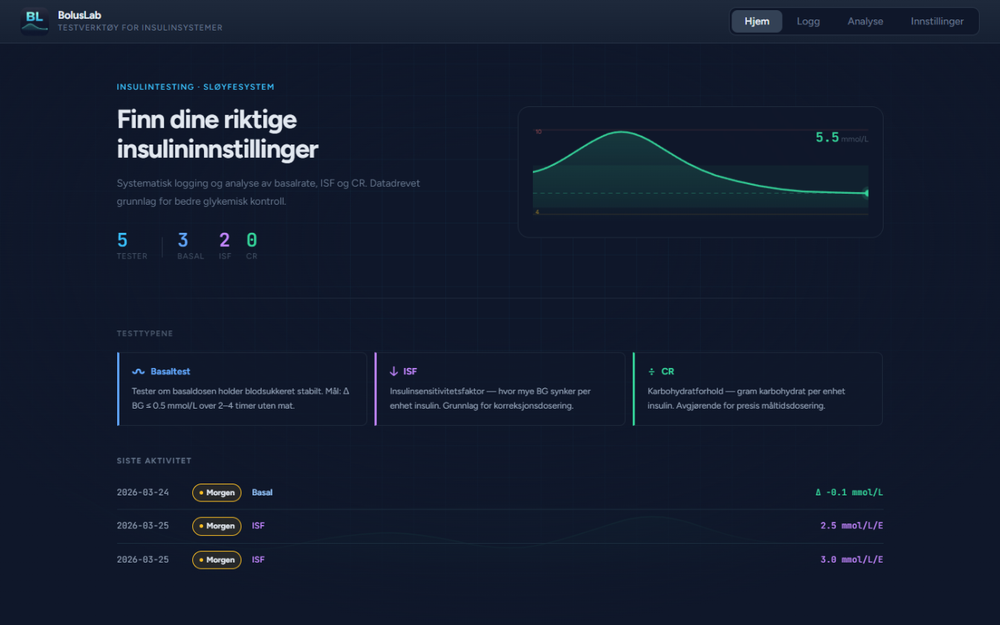
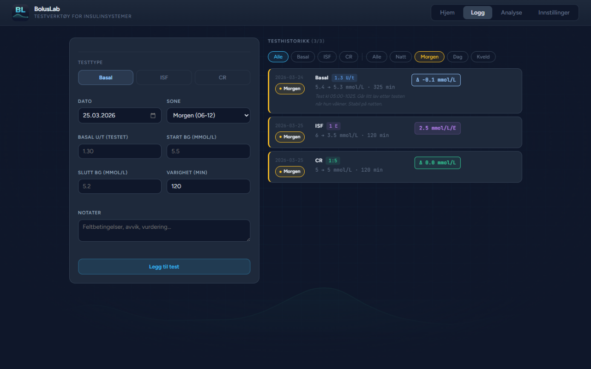
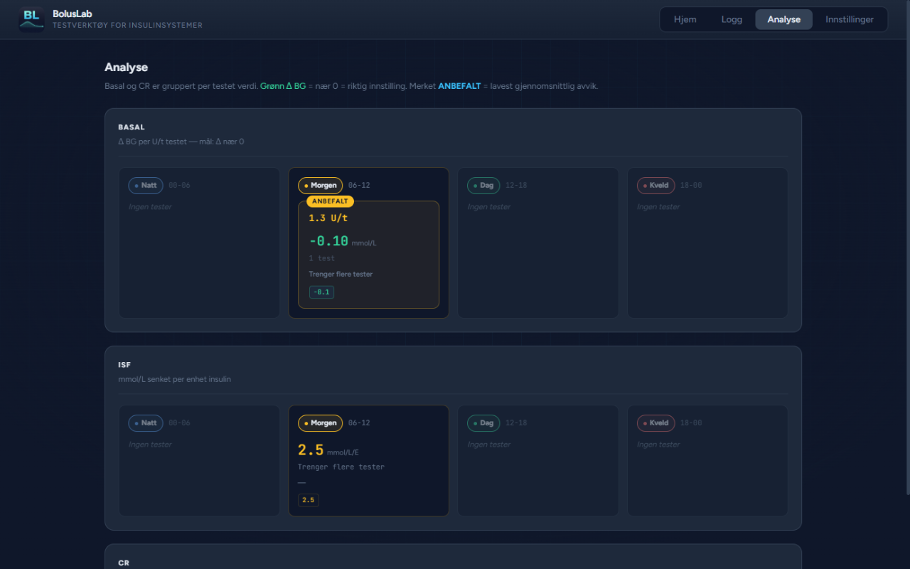
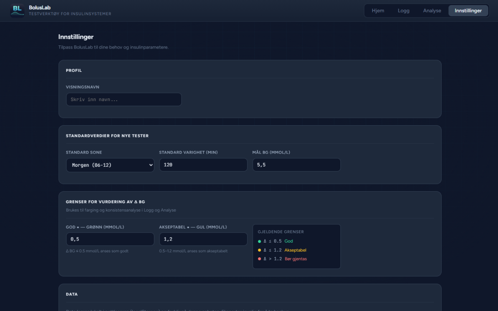

<div align="center">
  
  <h1>BolusLab</h1>
  <p>A systematic testing tool for insulin systems — log, analyze, and optimize basal rate, ISF, and CR.</p>

  
  
  
  
</div>

---

## Table of Contents

- [About](#about)
- [Screenshots](#screenshots)
- [Features](#features)
- [Getting Started](#getting-started)
- [Project Structure](#project-structure)
- [Technical Architecture](#technical-architecture)
- [Learning Journey](#learning-journey)
- [What I Learned About Vue.js](#what-i-learned-about-vuejs)

---

## About

BolusLab is a client-side web application designed to help users of insulin pumps and sensor-based systems (CGM / closed-loop) systematically test and fine-tune their insulin settings. The app provides structured logging, statistical analysis, and consistency evaluation for basal rate, insulin sensitivity factor (ISF), and carbohydrate ratio (CR) tests — organized by time-of-day zones.

All data is stored locally in the browser's `localStorage` — no server, no account, no data sharing.

The application interface is in Norwegian, as it was built for personal use.

---

## Screenshots

| Home | Log | Analyze |
|------|-----|---------|
|  |  |  |

| Settings |
|----------|
|  |

---

## Features

- **Test logging** — register Basal, ISF, and CR tests with start BG, end BG, dose, and notes
- **Time-zone segmentation** — four zones (Night, Morning, Day, Evening) for separating insulin needs throughout the day
- **Live preview** — see calculated Δ BG and ISF in real time while filling out the form
- **Analysis view** — grouped statistics per tested value with mean, standard deviation, and a RECOMMENDED badge
- **Consistency analysis** — automatic evaluation of whether tests are consistent enough to act on
- **Sparkline charts** — mini line graphs per test group for visual spread visualization
- **Configurable thresholds** — set your own green/yellow/red boundaries and target BG in Settings
- **Export / Import** — back up all data as JSON, restore from file
- **Local persistence** — all data saves automatically to `localStorage`

---

## Getting Started

### Prerequisites

- Node.js 18+
- npm

### Installation

```bash
git clone https://github.com/your-username/BolusLab.git
cd BolusLab
npm install
npm run dev
```

Open [http://localhost:5173](http://localhost:5173) in your browser.

### Build for production

```bash
npm run build
npm run preview   # preview the production build locally
```

---

## Project Structure

```
src/
├── App.vue              # Root component — navigation and view routing
├── main.js              # Entry point
├── style.css            # Global design tokens (colors, fonts, spacing)
├── constants.js         # ZONES and TEST_TYPES definitions
├── state.js             # Shared reactive state with localStorage persistence
│
├── components/
│   ├── BgLayer.vue      # Full-screen background effect (grid, BG curve, vignette)
│   ├── BgChart.vue      # Hero chart with SVG draw animation on mount
│   ├── RateCard.vue     # Stats card — sparkline, Δ BG, consistency label, RECOMMENDED badge
│   ├── Sparkline.vue    # SVG mini line chart with optional zero line
│   ├── DataCard.vue     # Export, import, and deletion of all data
│   ├── SectionCard.vue  # Card container with title/subtitle props
│   ├── Field.vue        # Form field wrapper with label
│   ├── ZoneBadge.vue    # Colored zone pill
│   └── Chip.vue         # Filter toggle button with color support
│
└── views/
    ├── HomeView.vue     # Landing page — hero, stats counters, test type info, recent activity
    ├── LogView.vue      # Test registration form and filterable history
    ├── AnalyzeView.vue  # Analysis of Basal, ISF, and CR grouped by zone
    └── SettingsView.vue # Profile, defaults, thresholds, data management
```

---

## Technical Architecture

**Routing** is implemented with `v-if`/`v-else-if` in `App.vue`. Views remount on every navigation switch, which simplifies form state management without needing a router.

**Shared state** uses Vue 3's `reactive()` directly — no Pinia or Vuex. `entries` and `settings` are exported from `state.js` and imported where needed. `watch()` automatically syncs changes to `localStorage`.

**Domain logic** (Δ BG, ISF, CR calculations) lives as plain functions inside the components that use them — no global service layer needed at this scale.

**Background layer** (`BgLayer.vue`) is mounted in `App.vue` as `position: fixed`, making it visible on all pages without each view having to include it.

---

## Learning Journey

BolusLab was built as a learning project to teach myself Vue.js. Rather than following a traditional tutorial, I used AI as an interactive teacher — working through concepts step by step while building a real application I had a genuine use for.

The approach was incremental: each new Vue concept (reactivity, props, computed, slots, lifecycle hooks) was introduced at the point where it was actually needed to solve a real problem in the app. This made each concept concrete and immediately applicable rather than abstract. By the end of the project, I had gone from no Vue experience to building a complete, polished SPA with shared state, component architecture, SVG animations, and localStorage persistence — all through AI-guided learning by doing.

---

## What I Learned About Vue.js

### Reactivity

- **`reactive()`** — makes objects reactive. Mutations automatically trigger UI updates. Used for the `entries` array and `settings` object in `state.js`.
- **`ref()`** — makes primitive values (numbers, strings, booleans) reactive. Accessed via `.value` in script, but directly in templates.
- **`computed()`** — derived value that is cached and only recalculated when its dependencies change. Used for filtered lists, statistics, and live previews.

### The Component Model

- **`<script setup>`** — modern Vue 3 SFC syntax. Everything declared in the script block is automatically available in the template without a `return {}`.
- **`defineProps()`** — declares which props a component accepts. Used in all reusable components (RateCard, Sparkline, ZoneBadge, etc.).
- **Slots** — `<slot>` lets a parent component inject content into a child component. Used in `SectionCard.vue` and `Field.vue` to create flexible layout wrappers.
- **Scoped CSS** — `<style scoped>` automatically restricts styles to the current component via data attributes, preventing leakage.

### Template Directives

- **`v-if` / `v-else-if` / `v-else`** — conditional rendering. Components removed with `v-if` are fully unmounted and remounted when shown again.
- **`v-for`** — loops over arrays or objects. Always paired with `:key` for efficient DOM reconciliation.
- **`v-model`** — two-way data binding between form inputs and reactive state. The `.number` modifier auto-converts string input to numbers.
- **`:bind` (shorthand for `v-bind`)**  — binds JavaScript expressions to HTML attributes and props. Used everywhere for dynamic styles, classes, and prop values.
- **`@event` (shorthand for `v-on`)** — listens for DOM events and calls handler functions.

### Lifecycle and Side Effects

- **`onMounted()`** — runs after the component has been inserted into the DOM. Used for counter animations with `requestAnimationFrame` and for reading initial state.
- **`watch()`** — observes reactive values and runs a callback on change. Used in `state.js` to sync `entries` and `settings` to `localStorage`. The `{ deep: true }` option watches nested changes inside objects and arrays.

### Patterns and Architecture

- **Shared state without Vuex/Pinia** — exporting `reactive()` objects from a shared file (`state.js`) and importing them where needed is sufficient for a client-only app. No store library required.
- **Remount as an alternative to `watch`** — because `App.vue` uses `v-if`/`v-else-if`, views remount on navigation. This means `onMounted` always re-initializes forms from current `settings`, eliminating the need to `watch` for settings changes inside views.
- **Props down, events up** — data flows down through props; child components communicate upward via `$emit`. This keeps data flow predictable and components reusable.
- **`computed` for derived data** — never calculate values directly inside templates. Using `computed()` for filtering, statistics, and formatting keeps templates clean and calculations efficient.
- **Direct mutation of shared `reactive` objects** — `v-model` can bind directly to `settings.property` in SettingsView because `settings` is a shared `reactive()` object. Changes immediately propagate to any other component using the same value.
